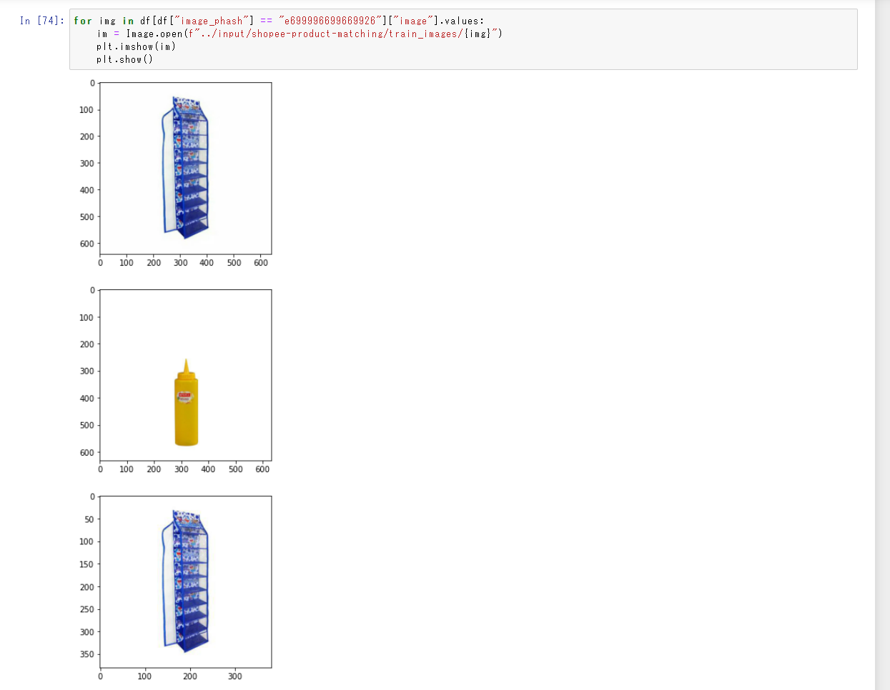
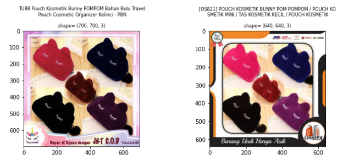
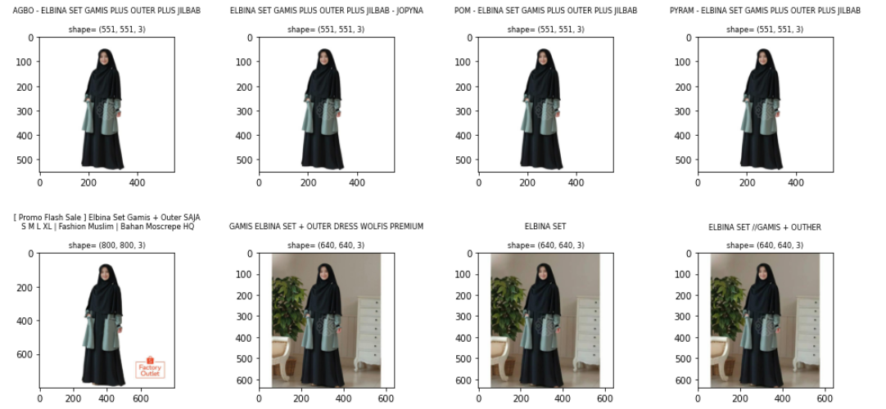
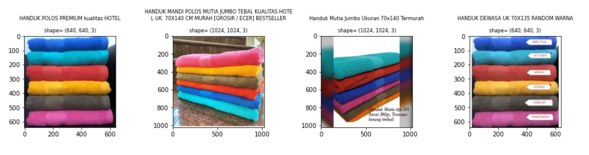
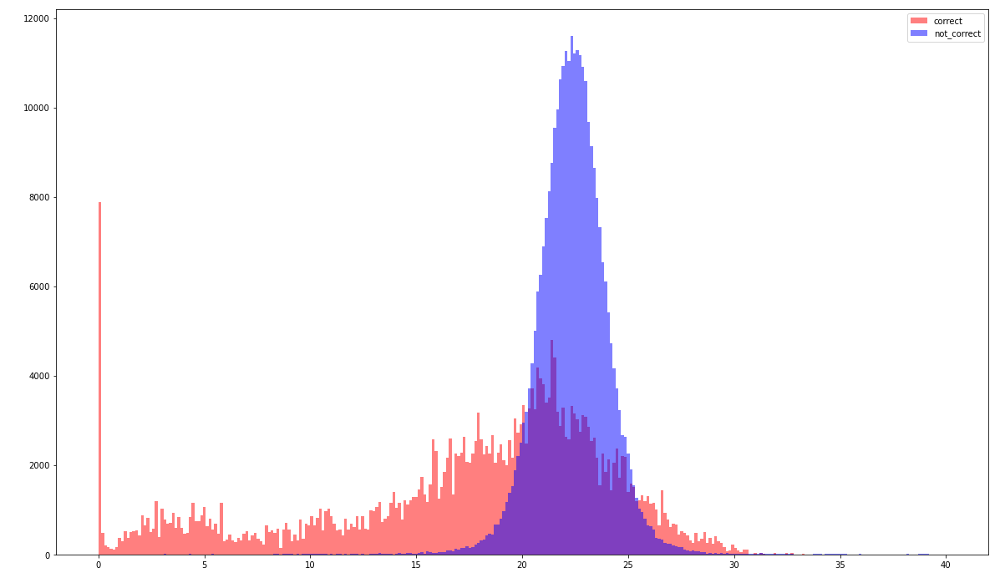

# 2021/4/1
* 今日から頑張る
* [TODO] foldの切り方。ランダムなのか?未知ラベルでvalidationする方がいいのか?
    * とりあえず前者でやってlossとか計算する。。
* BERTはそんなに学習率高くなくていい気がする

# 2021/4/3
https://www.mindmeister.com/1844996822?e=turtle
↑でタスク管理

* CNN単体だとうまくいくが, bertだとうまくいかない。。
 -> BERTの取り入れ方をいろいろいじる
  　①cnnとbertで別口のfcを用意→ダメ
  　②automodelの[1]を抽出(なんだこれ)してたのを、[0]、つまり普通の層を出力し平均とったらまだましだった
  

* csvデータはインドネシア語
    * bert-base-multilingual-uncasedを使うとどうだろう?

# 2021/4/4
* exp002は未知ラベル少し加えてミックス
* exp003はvalを未知ラベルだけにして同じ実験してみる
* exp003より, base_lrも小さい方がいいということがわかった！

# 2021/4/5
* exp006: train/valを分ける, 10foldでやる

# 2021/4/6
* stable cvを考える
  * なんでCV-LBで乖離があるのか？　→　データ分布を見てみよ
    * そもそもデータ分布
    * グループ1件のときや2件のときの件数と精度
  * kfold(3)とかでやってみるとどうだろう。。(->exp007)
  * kfold(3)のアンサンブルをとるようなのやってみよう

# 2021/4/7
* kfold(2) exp007 -> bert CV:0.787 - LB:0.649
* kfold(2) with euclidean distance
* image_phashの名寄せは万能じゃない 0.7887 -> 0.7875
* text名寄せはいいかも　0.7887 -> 0.7907 (+0.02)

# 2021/4/8
* EDA2: 全画像のペア見る　→　Augmentation考察
  * randomcrop
    
  * centorcrop
  * 人だけとってくる
    
  * メモ：大文字と小文字は区別要らなさそう
  * 角度回転して確認してみたい。。
    
  
* exp008: https://www.kaggle.com/c/shopee-product-matching/discussion/228794　これでfold切ってみる。。

* exp010: andomcrop

# 2020/4/11
* あってるやつと間違ってるやつの距離差

  
* exp013: BERT+image(512*512)
  CV: 0.837(fold0) -> LB: 0.727 (th=15)
* exp014: BERT-CNNでdropout平等 + いろいろ実験