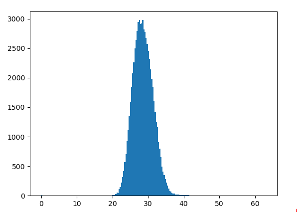
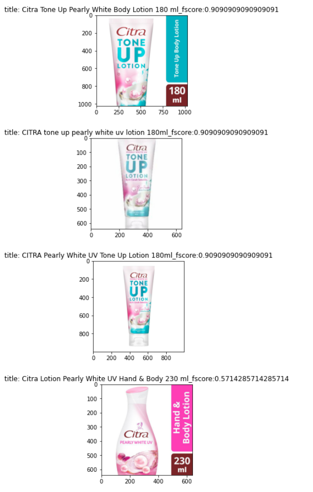

# 2021/4/1
* 今日から頑張る
* [TODO] foldの切り方。ランダムなのか?未知ラベルでvalidationする方がいいのか?
    * とりあえず前者でやってlossとか計算する。。
* BERTはそんなに学習率高くなくていい気がする

# 2021/4/3
https://www.mindmeister.com/1844996822?e=turtle
↑でタスク管理

* CNN単体だとうまくいくが, bertだとうまくいかない。。
 -> BERTの取り入れ方をいろいろいじる
  　①cnnとbertで別口のfcを用意→ダメ
  　②automodelの[1]を抽出(なんだこれ)してたのを、[0]、つまり普通の層を出力し平均とったらまだましだった
  

* csvデータはインドネシア語
    * bert-base-multilingual-uncasedを使うとどうだろう?

# 2021/4/4
* exp002は未知ラベル少し加えてミックス
* exp003はvalを未知ラベルだけにして同じ実験してみる
* exp003より, base_lrも小さい方がいいということがわかった！

# 2021/4/5
* exp006: train/valを分ける, 10foldでやる

# 2021/4/6
* stable cvを考える
  * なんでCV-LBで乖離があるのか？　→　データ分布を見てみよ
    * そもそもデータ分布
    * グループ1件のときや2件のときの件数と精度
  * kfold(3)とかでやってみるとどうだろう。。(->exp007)
  * kfold(3)のアンサンブルをとるようなのやってみよう

# 2021/4/7
* kfold(2) exp007 -> bert CV:0.787 - LB:0.649
* kfold(2) with euclidean distance
* image_phashの名寄せは万能じゃない 0.7887 -> 0.7875
* text名寄せはいいかも　0.7887 -> 0.7907 (+0.02)

# 2021/4/8
* EDA2: 全画像のペア見る　→　Augmentation考察
  * randomcrop
    
  * centorcrop
  * 人だけとってくる
    
  * メモ：大文字と小文字は区別要らなさそう
  * 角度回転して確認してみたい。。
    
  
* exp008: https://www.kaggle.com/c/shopee-product-matching/discussion/228794　これでfold切ってみる。。

* exp010: andomcrop

# 2020/4/11
* あってるやつと間違ってるやつの距離差

  
* exp013: BERT+image(512*512)
  CV: 0.837(fold0) -> LB: 0.727 (th=15)
* exp014: BERT-CNNでdropout平等 + いろいろ実験

# 2021/4/12
* cpptakeさんに教えてもらったAdacosをベースに論文調査
* exp016: bert-base-indonesian-522M -> そんな変わらん

* exp017: distanceを正規分布過程で疑似的に65000件生成し、70000件での画像検索を想定する

  
* exp018: exp013 + OCR -> そんなに

* exp019: いろんなモデル試す + アンサンブルできるようにする
* exp020: アンサンブル実験用コード(fold同じ)
* exp021: CNN -> BERT

# 2021/4/14
* batch_sizeがかなり学習結果に影響してそう。batch_size=8のものは軒並み精度が出ていない気がする。
  -> LRを増やさないと学習進まない? bs=16とbs=8だったら後者がlr2倍か?小さいモデルで実験してみよう
  -> exp022
  
* optimize_ensemble_v1_20210414
  * single best: CV 0.856
  * ensemble major: threshold 18.5 -> CV 0.8764
  
* exp022
  bs [8, 12, 16] -> CV: 0.8067 - 0.8216 - 0.8271
  bs [8, 12, 16] (lr調整:減らす) -> だめ
  bs [8, 12, 16] (lr調整:増やす) -> CV: 0.8067 -
  
# 2021/4/15
ある程度実験は落ち着いたので考察。実験をどの方向に進めるか、先1週間程度決めておきたい。
全部やってからアンサンブルする

* いろんなCNNのモデル
  金に行くんであれば、もっといいCNNモデルが必要になるのでは
* optimizer
  * 
* learning_rate
  * cosine scheduler
* augmentation
  これパクる: https://www.kaggle.com/c/landmark-recognition-2020/discussion/187757
* loss
  * focal loss
* metric learning
  * adacos
  * circle loss
  * subcenter arcface
* ハイパラ
  * 画像サイズ
  * linear
* gem pool
  def gem(x, p=3, eps=1e-6):
      return F.avg_pool2d(x.clamp(min=eps).pow(p), (x.size(-2), x.size(-1))).pow(1./p)

* nearest neighbor: superglue

* exp023: focal loss
* exp024: metric learning (adacos, subcenter_arcface)
* exp025: activation
* exp026: poolingを頑張る
  * gem
  * gem(cnn+bert)
  * clsトークン
  * 最終4つのclsトークン

# 2021/4/16
* exp026: すべてのlayerのclsトークンで重み付けてアンサンブル
* exp027: すべてのlayer + 従来通り で重み付けてアンサンブル
* exp028: 単語ごとの平均をとる(実装勘違いしてた) -> だめ笑
* exp029: token size = 128 -> 64 CV: 0.8574(+0.0014)
* exp030: efficientnet_b5のgrid search(imgsize=256)
* exp031: final layer のlr調整 -> fc1e-3, cnn1e-4だとepoch=3で 0.849(epoch=1で0.829)
* exp031_2: final layerのlrいいやつで、bert元に戻す -> fc1e-3, cnn1e-4, epoch=1で0.830
* exp032: bert_lrを振る -> 2.5e-5でCV: 0.837.
  -> さらに周辺で振る -> 3e-5でCV: 0.838
* exp033: exp032の結果でいろんなモデル流す
  -> うーんダメ, exp032の実験は最初の1epochがよかっただけっぽい。。。
* exp034: exp033 + bert 1e-5
* exp035: augmentationをパクる -> CV: 0.858 (+0.002)
* exp036: augmentation + centercrop
* exp037: xlm_roberta_lr
* exp038: kiccho-sanのbert4層 -> Cv: 0.8585
* exp039: 複数fc
* exp040: dim=(720, 720)
* exp041: いろいろ -> cnn_lr=3e-4がよい感じなので、exp041_bestからスタート

# 2021/4/19
* exp042: gem
* exp043: cnn/bertをそれぞれdropout
* exp044: kiccho_san cls + dropout
  * dout=0 -> CV: 0.8613
  * dout=0.2 -> CV: 0.0.8618
* exp045: num_linear
* exp046: triplet lossも加えたい
* exp047: apex使う(exp044_best + batch_size=32)
  * torch.whereの前のところhalfにする
  * よくわからんバグを踏んだので後回し。。。
* exp048: transformer(すて)
* exp049: transformer(すて)
* exp050: bert lr=5e-4, 1e-4

# 2021/4/21
* exp051_2: bert+transformer CV: 0.8790!!!!
  * http://localhost:8888/notebooks/optimize_ensemble_v4_20210421.ipynb
   -> CV: 0.9005(今までの4model ensemble: CV: 0.886x)
* exp052: exp051_2 と従来方式のconcat

# 2021/4/22
* exp057: model 作り直し(cosine annealing)
* exp058: transformer(channel方向)

* exp054_4: exp054 transformerのinputを直した -> だめ

# 2021/4/23
* exp060: all_dataで学習させる(exp044_best)
* exp059: bertに突っ込むタイプの構造; LR=1e-3, 1e-4で振る(epochs=2)
* exp054_4: LR=1e-3,1e-4で振る

* exp061: pre-training
* exp062: pre-training(full batchsize)

# 2021/4/24
* exp065: progressive learning(3epoch)
* exp066: progressive learning(2epoch)
* exp067: number_to_str
* exp068: transformer(n_layer=2)
* exp069: image-textのペアもlossに加えてみる
  
# 2021/4/25
* exp070: text, image単体でも
* exp071: ぼつ
* exp072: progressive learning(1epoch)

* exp073: bert+distilbert
* exp074: cnn_modelをdistilbertで振る

* exp075: half data. (for threshold search)
* exp076: transformer:
  like https://github.com/DylanCope/Image-Captioning-with-Bimodal-Transformers

# 2021/4/26  
* exp077: bert
* exp078: cnn(maxpool + avgpool)

数値_ml は違うものだと認識させたいよね～

# 2021/4/27
* exp074_2: distilbertでs, mを振る(ちゃんとふれてなかった)
* exp080: linear_outをふる
* exp081:
* exp083: decoder も試したい(途中であきらめ)

# 2021/4/28
* exp074_3: distribert + linear_out2048
* exp080_2: linear_outさらに上に振る
* exp084: linear_out2048 + text, img はfc加える
  1model-3出力, 1modelだけで試してみたんですが
  ・concat best: CV 0.881(th=0.55)
  ・concat-image-text best?: CV: 0.8838(concat_th=0.5, image_th=0.6, bert_th=0.7)
  と+3ptでした。枝分かれさせた方が0.6ptくらい向上幅ありました！
* exp085: transformer + s/m調整

# 2021/4/29
* exp086: exp074_3 + exp084(3loss, text/imgはfc, linear_out=2048)
* exp086_2: s/m条件ふり
* exp084_2: linear_out2048 + 4層平均(入れ忘れた) -> 没

# 2021/4/30
* exp090: 
* exp091:
  228*228でいろいろ試す
  
* ensemble_v20:
  * 以下4modelで、通常ensembleと4model ensembleの差を見たい
    * swin_base_patch4_window7_224 
    * vit_base_patch16_384 
    * swin_base_patch4_window12_384
    * swin_large_patch4_window7_224
  * all_embeddings only -> CV: 0.8888(th=0.56)
  * 12model -> CV: 0.8935(+4.7pt/th=0.5/0.75/0.75)
  
* exp092: exp091 + eff_v3 + transformer

# 2021/5/1
* ensemble_v22:
  * original CV: 0.8895(cv=0.53)

# 2021/5/2``
* カフェで頭整理した。。。。（頭が死んでた）

* exp094でmを振った結果, m=0.2がいいっぽい(epochs=2まで)
http://34.121.203.133:5000/#/metric/val_cv_score?runs=[%223ec191c81ec64b98a586e0adbf44cf81%22,%22792ecd1e413f4349ae349e75712d2667%22,%224d48fb3684de48cfad791e21f9d2e5e0%22,%2265b527e44a52465c819d3ba4fc2473f8%22]&experiment=7&plot_metric_keys=[%22val_cv_score%22]&plot_layout={%22autosize%22:true,%22xaxis%22:{},%22yaxis%22:{}}&x_axis=relative&y_axis_scale=linear&line_smoothness=1&show_point=false&deselected_curves=[]&last_linear_y_axis_range=[]
  
* exp095 -> m=0.2, 0.3で全部回す(BERT)
* exp096: BERTModule hidden層の4層平均に加えて, CLS層の4層平均も！
* exp097: residual
* exp098: residual + add
* exp099: add
* exp100: Adacos Paramtune(epoch=3)
* exp101: fc_lr tune

# 2021/5/3
* exp104: 224sizeでたくさんのモデル作ってみる
